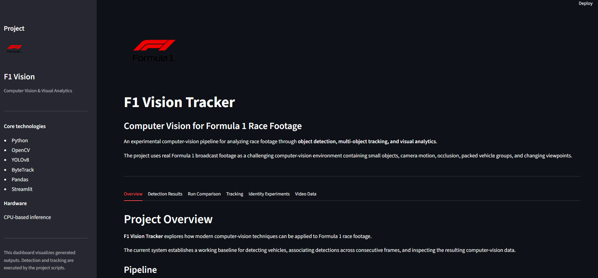
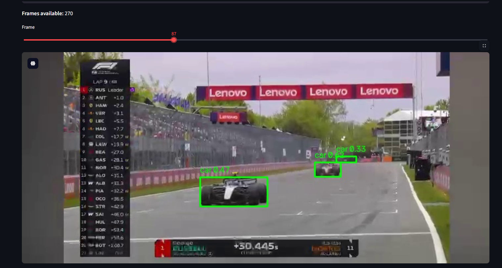
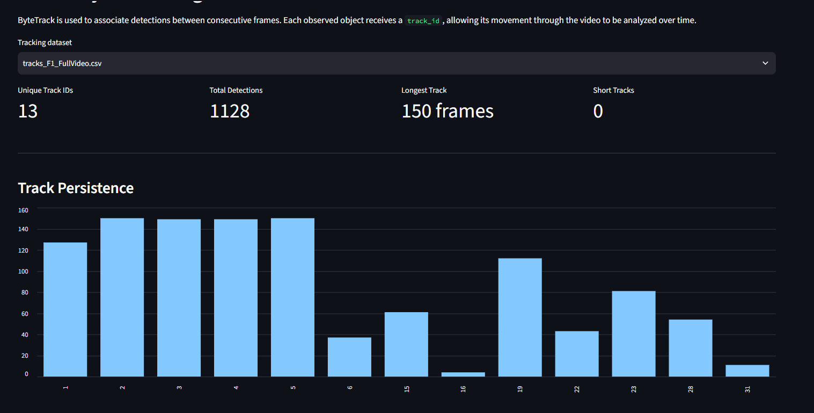

# 🏎️ F1 Vision Tracker

**Computer Vision for Formula 1 Race Car Detection & Tracking**

F1 Vision Tracker is a computer-vision project that analyzes Formula 1 race footage to detect and track race cars across video frames.

The project explores a practical pipeline from raw video to object detection, multi-object tracking, track analysis, and interactive visualization.

---

## 🎯 What It Does

```text
F1 Video
   ↓
Frame Extraction
   ↓
YOLOv8 Detection
   ↓
ByteTrack Tracking
   ↓
Track Analysis
   ↓
Interactive Streamlit Dashboard
```

The system currently supports:

* 🚗 Race-car detection using YOLOv8
* 🎯 Multi-object tracking with persistent track IDs
* 📍 Bounding-box and position tracking
* 📊 Track-duration and detection analysis
* 🖥️ Interactive Streamlit visualization
* 🧪 Experimental vehicle identity analysis

> The current system focuses on **race-car detection and tracking**. Driver identification and advanced race analytics are experimental future extensions.

---

## 🛠️ Tech Stack

| Technology           | Purpose                  |
| -------------------- | ------------------------ |
| Python               | Core development         |
| YOLOv8 / Ultralytics | Object detection         |
| ByteTrack            | Multi-object tracking    |
| OpenCV               | Video & image processing |
| Pandas               | Data analysis            |
| Streamlit            | Interactive dashboard    |
| Git & GitHub         | Version control          |

---

## 📁 Project Structure

```text
F1project/
│
├── data/
│   └── videos/
│       └── README.md
│
├── src/
│   ├── app.py
│   ├── detector.py
│   ├── tracker.py
│   ├── frame_extractor.py
│   ├── video_info.py
│   ├── scene_detector.py
│   ├── track_analysis.py
│   └── identity.py
│
├── notebooks/
│
├── assets/
│   ├── detection_example.jpg
│   ├── tracking_example.jpg
│   └── dashboard.png
│
├── outputs/
│   └── README.md
│
├── README.md
├── requirements.txt
└── .gitignore
```

---

## 🔍 Detection

The project uses a pretrained **YOLOv8** model to detect vehicles in Formula 1 footage.

Each detection records:

* Bounding-box coordinates
* Confidence score
* Object class
* Frame position
* Object center coordinates

The detection stage is also used to evaluate common failure cases such as missed cars, low-confidence detections, class confusion, and duplicate boxes.

---

## 🎯 Tracking

Detected vehicles are tracked across consecutive frames using **ByteTrack**.

Each tracked object receives a persistent ID:

```text
Frame 100 → ID 4
Frame 101 → ID 4
Frame 102 → ID 4
Frame 103 → ID 4
```

Tracking results are exported as structured CSV data for further analysis.

---

## Interactive Dashboard

The project includes a Streamlit dashboard for exploring generated results.

It provides:

* Detection frame inspection
* Detection-run comparison
* Tracking statistics
* Track-length analysis
* Tracking data tables
* Experimental identity information
* Video metadata

Run it with:

```bash
streamlit run src/app.py
```

### Dashboard



### Detection



### Tracking



---

## 🚀 Getting Started

### 1. Clone the repository

```bash
git clone https://github.com/BarshaBhusal/f1-vision-tracker.git
cd f1-vision-tracker
```

### 2. Create a virtual environment

```bash
python -m venv venv
```

Windows:

```bash
venv\Scripts\activate
```

### 3. Install dependencies

```bash
pip install -r requirements.txt
```

### 4. Add your video

Place your local race footage inside:

```text
data/videos/
```

Large video files are excluded from the repository.

### 5. Run detection

```bash
python src/detector.py --video data/videos/F1_FullVideo.mp4 --count 10
```

### 6. Run tracking

For a quick test:

```bash
python src/tracker.py --video data/videos/F1_FullVideo.mp4 --max-frames 150
```

### 7. Launch the dashboard

```bash
streamlit run src/app.py
```

---

## ⚠️ Current Limitations

Formula 1 footage presents several challenges for a generic object-detection model:

* Small and distant cars can be difficult to detect.
* Cars can overlap during close racing.
* Generic object classes do not perfectly represent F1 cars.
* Tracking can fragment during occlusion.
* Driver identification is not currently reliable.
* Real-world speed is not calculated.

These limitations are treated as part of the experimentation process rather than hidden from the results.

---

## 🔮 Future Work

* Fine-tune a detector specifically for Formula 1 cars
* Improve race-car filtering and false-positive rejection
* Evaluate stronger tracking/re-identification methods
* Add car-number and livery recognition
* Detect overtakes and race-order changes
* Add lap and sector detection
* Explore camera calibration for real-world motion analysis

---


## 👩‍💻 Author

**Barsha Bhusal**
BSc (Hons) Computing with Artificial Intelligence

[GitHub](https://github.com/BarshaBhusal)


